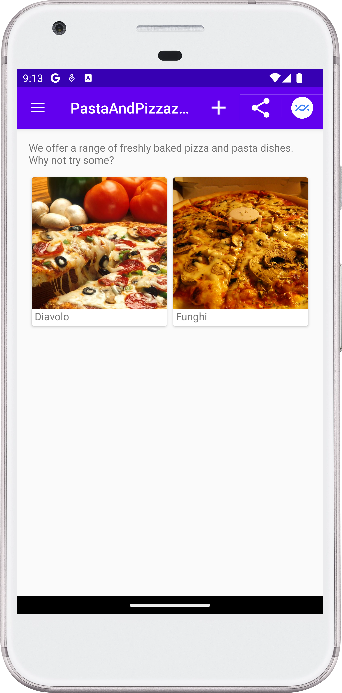
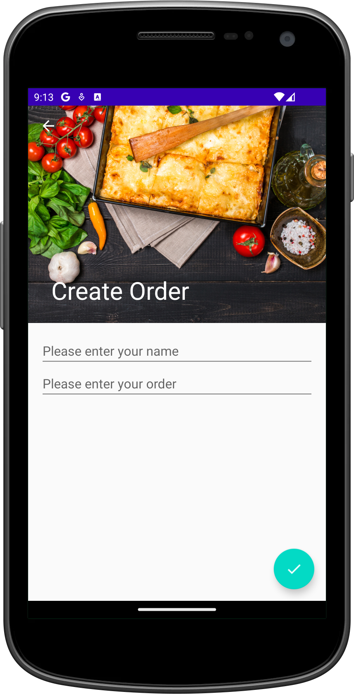
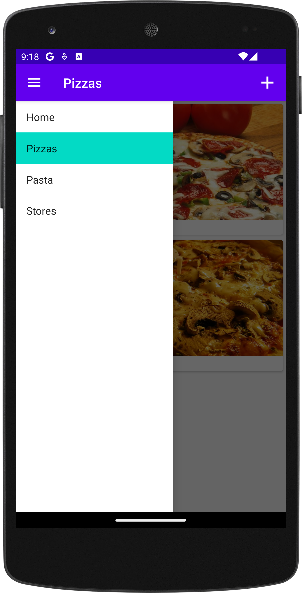
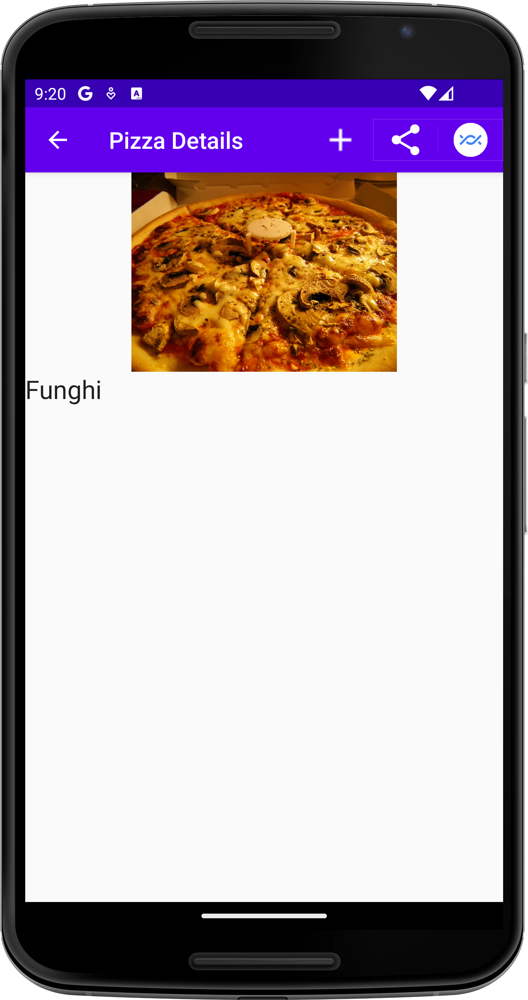

[](https://stand-with-ukraine.pp.ua)


# PastaAndPizzaz Delivery

A nice way of implementing a navigation drawer for an Android app. The project
serves as a feature demonstration and doesn't have functional delivery
capabilities.

## Features

- [Android](https://developer.android.com/studio/intro): Built
  using [Kotlin](https://kotlinlang.org/).
- **Architecture
  **: [Monolith](https://en.wikipedia.org/wiki/Monolithic_architecture).
- **Collapsing Toolbar**: For a smooth and dynamic UI.
- **Grid of Pizzas**: Displays pizzas on the main screen; clicking opens a
  details screen.
- **Order Form**: A "+" button in the app bar opens a form to order pizza.
- **Share Button**: Includes options for Bluetooth and Nearby sharing.
- **Code Readability:** code is easily readable with no unnecessary blank
  lines, no unused variables or methods, and no commented-out code, all
  variables, methods, and resource IDs are descriptively named such that another
  developer reading the code can easily understand their function.

## Screenshots

<!--suppress CheckImageSize -->





## Installation Instructions

- Clone the repository:

```bash
git clone https://github.com/Turskyi/PastaAndPizzaz-NavDrawer.git
```

- Open the project in Android Studio.
- Run the project on an emulator or a physical Android device.

## Usage

The project is intended for educational purposes. You can copy and paste the
code for reuse in your own projects.

## Contributing

Contributions are welcome! Feel free to create a pull request into the `master`
branch. However, please note that this is a sample app and contributions may
not be necessary.

## License

No intentional license was used for this project.

## Acknowledgments

This project was inspired by the tutorial from the book "Head First Android
Development" by Dawn Griffiths and David Griffiths.

